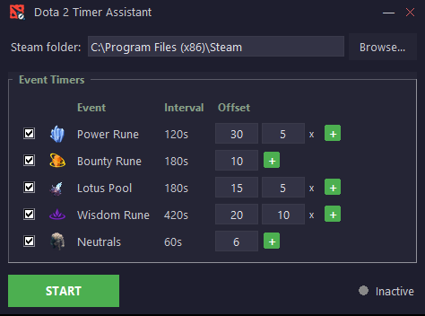

# Dota 2 Timer Assistant

Desktop app that gives you TTS audio alerts for recurring Dota 2 events (runes, lotus, stacks) by reading the game clock via Game State Integration.



## Tracked events

| Event       | Interval | First occurrence |
|-------------|----------|------------------|
| Power Rune  | 2 min    | 0:00             |
| Bounty Rune | 3 min    | 0:00             |
| Lotus Pool  | 3 min    | 0:00             |
| Wisdom Rune | 7 min    | 0:00             |
| Stack       | 1 min    | 1:00             |

Each event has a configurable pre-alert (default 30 s) so you hear "power rune in 30 seconds" before the event fires.

## How it works

1. On startup, the app generates TTS audio clips for every event/delay combination using `pyttsx3` and caches them as WAV files.
2. When you click **Start**, it writes a GSI config into your Dota 2 installation and starts a local HTTP server on port 3000.
3. Dota 2 sends game state updates (clock, pause state) to that server.
4. The timer engine checks the clock against event schedules and plays the appropriate clip via `pygame`.

## Requirements

- Python 3.12+
- Linux: `espeak` (`sudo apt install espeak`)
- Windows: no extra system dependencies (uses SAPI5)

## Setup

```bash
# Install dependencies
poetry install

# Run
poetry run python main.py
```

Point the **Steam folder** field at your Steam installation (e.g. `~/.steam/steam` or `C:\Program Files (x86)\Steam`), then click **Start**. Launch a Dota 2 match and the timer will activate automatically.

## Pre-built binaries

Download from [Releases](../../releases). Tag pushes (`v*`) trigger CI builds for Linux and Windows.

- **Windows**: double-click `dota2_timer-windows-amd64.exe`
- **Linux**: `chmod +x dota2_timer-linux-amd64 && ./dota2_timer-linux-amd64` (requires `espeak` installed)
